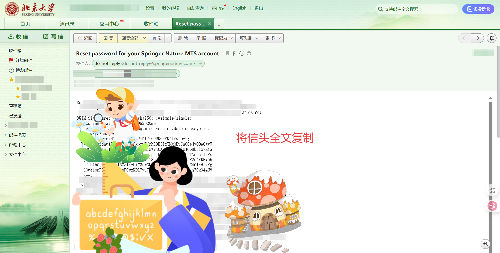

# 使用 VPN 科学上网(小白版)

## 一、免责声明与 VPN 科普

> ⚠️ **免责声明：**  
本教程仅用于学习与科研目的，严禁用于任何违反当地法律法规的用途。使用 VPN 请遵守所在国家或地区的相关法律政策，作者不对任何因使用本教程而产生的后果负责。

### 什么是 VPN？

VPN（Virtual Private Network，虚拟私人网络）可以帮助你加密网络流量、保护隐私，甚至绕过网络限制访问被屏蔽的网站。VPN 最初用于内部人员在单位网络环境外访问单位内网(如校园网环境下才能访问的网站)，大致原理就是将你原本的上网IP改为内部网络服务器“认识”的IP，从而成功访问内网网站。

而今，VPN 的用途被扩大到：中国内地（**新疆**、**西藏**万不可）网民绕过“中国网络防火长城(GFW)”访问外网，如 Google、YouTube、Github(不稳定,偶尔能上)，很多外网网站因不禁止黄色、暴力、犯罪和政治敏感内容而被屏蔽。然而，作为一名合格的网上冲浪者，应当学会分辨各种信息，取其精华去其糟粕，充分利用内网难以获取的优质信息。

VPN 常用工具(俗称“机场”)：**Clash** 是一个支持多协议、多平台的开源代理客户端。

---

## 二、订阅链接获取方法

Clash 使用**订阅链接**(停在"机场"的"飞机"，带你去世界各国各地区)导入节点信息。你可以通过以下几种方式获取订阅链接：

- 向朋友或群组索要已**购买**的代理服务链接
- 在线订阅平台（如机场服务）**购买**后自动生成
- 某些网站分享**免费**订阅（**不稳定**，仅供测试）

订阅链接一般长这样：
```
https://example.com/api/v1/client/subscribe?token=xxxxxxxxxx
```

### 1. 适用北大校内用户的免费"翻墙"链接订阅方法：

老学长提供的[Wallesspku项目](https://189854.xyz/verify)，自订阅之日起，每月有**20G**流量可用于访问墙外网站。

#### 第一步

打开[账号重置界面](https://mts-spd.nature.com/apps/spd.plex?form_type=forgot_password&j_id=18)，输入你的PKU邮箱，让网址给你发邮件。


#### 第二步

打开你的PKU邮箱，找到最新未读邮件，点击“更多”，点击“查看信头”，将信头复制。




#### 第三步

进入[Wallesspku项目](https://189854.xyz/verify)，将信头粘贴于空白处并点击“Submit”。


#### 第四步

你已经获取了Wallesspku的节点！**不要泄露**！！


### 2. 普通用户可使用的节点供应商

#### [九月鹿](https://user.jiuyuelu.xyz/auth)
- [点此注册](https://user.jiuyuelu.xyz/auth)
- 邀请码可选，也可填图中的


#### [狗狗加速 —— 技术流机场 Doggygo VPN](https://verge.dginv.click/#/register?code=oaxsAGo6)
- 高性能海外机场，免费试用，优惠套餐，解锁流媒体，全球首家支持 Hysteria 协议。
- 使用 Clash Verge 专属邀请链接注册送 3 天，每天 1G 流量免费试用：[点此注册](https://verge.dginv.click/#/register?code=oaxsAGo6)
- Clash Verge 专属 8 折优惠码: verge20 (仅有 500 份)
- 优惠套餐每月仅需 15.8 元，160G 流量，年付 8 折
- 海外团队，无跑路风险，高达 50% 返佣
- 集群负载均衡设计，高速专线(兼容老客户端)，极低延迟，无视晚高峰，4K 秒开
- 全球首家 Hysteria 协议机场，现已上线更快的 `Hysteria2` 协议(Clash Verge 客户端最佳搭配)
- 解锁流媒体及 ChatGPT
- 官网：[https://狗狗加速.com](https://verge.dginv.click/#/register?code=oaxsAGo6)

---

## 三、Windows 使用教程（Clash Verge）

### 1. 下载 Clash Verge

GitHub 项目地址：[Clash Verge](https://github.com/clash-verge-rev/clash-verge-rev/releases/tag/autobuild)

顺便关注[作者](https://github.com/clash-verge-rev)

> 推荐选不带arm64，带x64，后缀为`.exe`的

### 2. 安装与设置

1. 安装程序并运行
2. 第一次打开可能提示需要安装驱动，点击确认即可
3. 打开软件后，进入 **配置** 页面
4. 点击「订阅」→「添加订阅」，填入你的订阅链接，命名后点击「确定」
5. 回到首页，选择你刚添加的配置，点击「启用」
6. 可在「代理」标签中选择不同模式，如「规则」、「全局」、「直连」

### 3. 模式推荐

- **规则模式**（推荐）：自动判断走代理还是直连
- **全局模式**：所有流量都走代理，适合访问境外服务
- **直连模式**：不使用任何代理

---

## 四、Android（包括鸿蒙4.3及以下）使用教程（Clash Meta）

### 1. 下载 Clash Meta for Android

推荐使用第三方整理的「Clash Meta for Android」版本：

- GitHub 项目地址：[Clash Meta](https://github.com/Kejifaxian/welcome?tab=readme-ov-file)

> 或者直接点击这个安装包自动下载：cmfa-2.11.6-meta-arm64-v8a-release

### 2. 安装与配置

1. 安装并打开 Clash Meta 应用
2. 在首页点击右上角「+」，选择「订阅」
3. 点击「从URL导入」
4. 输入订阅链接，设置名称，设置更新时间（比如2048分钟）
5. 点击同步，成功后返回首页选择该配置
6. 开启 Clash 开关，授权 VPN 权限

### 3. 其他设置建议

- **模式设置**：推荐使用「规则模式」
- **通知栏显示延迟**：可以在设置中关闭
- **开机自动启动**：在设置中启用后更方便

---

## 五、注意事项

购买节点服务商后的注意事项确实很多，尤其对于追求稳定、安全和高效的用户来说。以下是一些关键点的总结：

### 1. 节点选择与推荐（国家/地区）

节点位置的选择直接影响连接速度、流媒体解锁能力和隐私合规性。

- **速度与延迟**：
    - **亚洲地区**：对于中国大陆用户，香港、日本、新加坡、韩国等地的节点通常延迟较低，速度较快。
    - **北美/欧洲**：如果你主要访问这些地区的网站或服务，选择对应地区的节点能提供更好的体验。
- **流媒体解锁**：
    - **美国**：解锁 Netflix (US), Hulu, Disney+ 等流媒体服务的首选。
    - **日本**：解锁日区 Netflix, AbemaTV, DMM 等。
    - **香港/台湾**：解锁部分亚洲区限定内容。
    - **英国**：解锁 BBC iPlayer 等英区服务。
- **隐私与法律合规**：
    - 考虑所在国家的隐私政策和数据保留法规。例如，一些注重隐私的国家（如瑞士、冰岛、巴拿马等）可能有更严格的数据保护法律。
    - 避免使用“五眼联盟”、“九眼联盟”、“十四眼联盟”成员国（如美国、英国、加拿大、澳大利亚、新西兰等）的节点，如果对隐私有极高要求。

### 2. IP 纯净度检测

IP 纯净度（或称IP信誉度）是指该 IP 地址被主要网络服务提供商（如流媒体平台、搜索引擎、邮件服务商等）识别为住宅IP还是机房IP，以及是否被列入黑名单。IP纯净度越高，越不容易被网站识别为代理或恶意流量，从而避免限制或验证。

- **检测工具**：
    - **IP 查询网站**：
        - `ipinfo.io`：提供详细的 IP 信息，包括 ISP、ASN (自治系统编号)、是否为托管服务（hosting）。
        - `whoer.net`：除了 IP 信息，还会显示你的匿名度评分，DNS泄漏，以及是否为黑名单IP。
        - `ipleak.net`：主要检测DNS泄漏、WebRTC泄漏等。
        - `ping0.cc`：IP 类型查询，风控指标检测，家宽 or 机房 IP
    - **流媒体解锁测试**：直接尝试访问目标流媒体平台（如 Netflix），如果能正常观看，说明该节点对该平台而言是“干净”的。
- **如何判断纯净度**：
    - **ISP 和 ASN**：如果显示为知名数据中心（如 AWS, Google Cloud, Azure, Alibaba Cloud 等）或大型服务器托管商，则通常是机房IP。住宅IP会显示为当地的宽带运营商。
    - **黑名单检测**：很多查询网站会同时检测IP是否在主要黑名单数据库中。
    - **匿名度评分**：分数越高越好。
    - **DNS泄漏**：确保你的DNS服务器与节点国家一致，或由服务商提供无泄漏的DNS。
    - **WebRTC泄漏**：同样需要检查避免真实IP泄露。

### 3. IP 更换频繁的后果

IP 更换（指服务商提供的出口IP频繁变动）可能带来一些不便和风险。

- **服务限制与验证**：
    - **流媒体平台**：Netflix、Disney+ 等会对IP频繁更换的用户进行更严格的检测，甚至可能导致账号被锁定或要求验证。
    - **网站/论坛**：一些网站如 X(Twitter)、Instagram 会识别频繁更换IP的行为为可疑活动，可能要求进行人机验证（reCAPTCHA），甚至暂时封禁IP或账号。
    - **在线银行/支付**：出于安全考虑，这些服务对IP地址非常敏感。频繁更换IP可能触发安全警告，要求额外验证，甚至冻结账户。
- **隐私和匿名性降低**：
    - 虽然更换IP可以增加追踪难度，但如果更换过于频繁且不规律，反而可能成为被识别的特征。
    - 对于需要保持稳定身份的应用（如登录某些服务），频繁更换IP会造成麻烦。
- **连接稳定性**：
    - 频繁更换IP可能意味着节点不稳定或服务商在进行维护，导致连接中断或速度波动。
- **避免方法**：
    - 选择提供**固定IP**或**相对稳定IP**的节点服务商（通常这类服务价格会更高）。
    - 对于一般使用，如果服务商能保证IP池的纯净度和充足性，偶尔的IP更换通常是正常的，不会造成太大影响。
    - 避免在短时间内手动频繁切换节点。

### 4. 其他重要注意事项

- **服务商信誉**：选择有良好口碑、运营时间长、用户评价积极的服务商。避免突然冒出来的“黑马”服务商，谨防跑路。
- **协议支持**：确认服务商支持你需要的协议（如 Clash, Hysteria, VLESS, Trojan, SS/SSR 等）。Hysteria 和 Hysteria2 等新协议通常在抗审查和速度方面表现更好。
- **流量与带宽**：根据自己的使用量选择合适的套餐，留意是否有月流量限制和限速策略。
- **客户支持**：良好的客户支持在遇到问题时至关重要。
- **退款政策**：了解服务商的退款政策，以防服务不满意。
- **免费试用/套餐**：优先选择提供免费试用或有优惠套餐的服务商，先体验再决定购买。
- **安全审计/日志策略**：了解服务商是否记录用户日志。通常宣称“无日志策略”的服务商更受隐私用户青睐。
- **支付方式**：选择支持多种安全支付方式的服务商。
